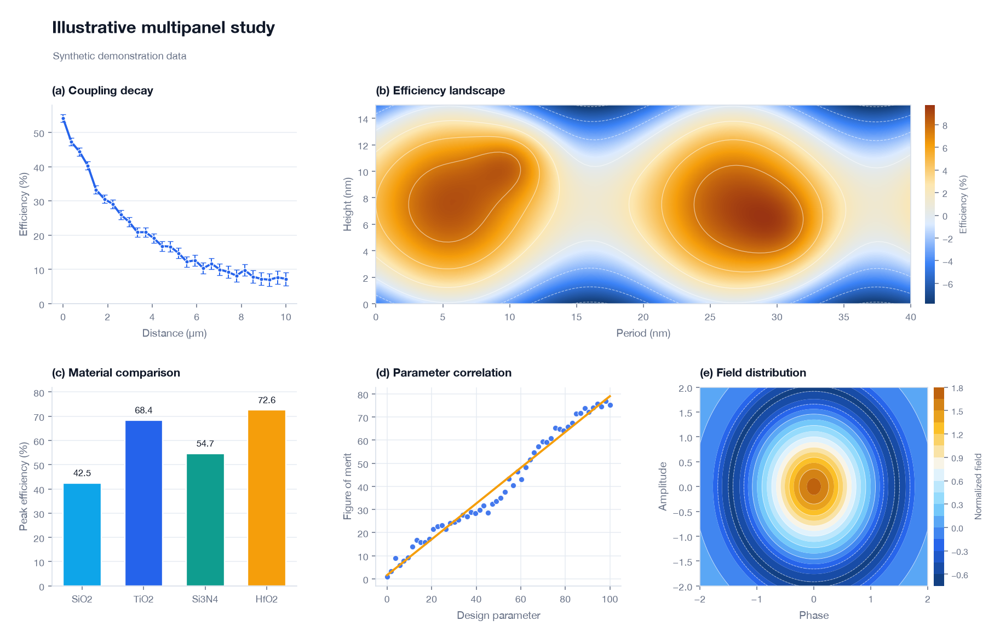
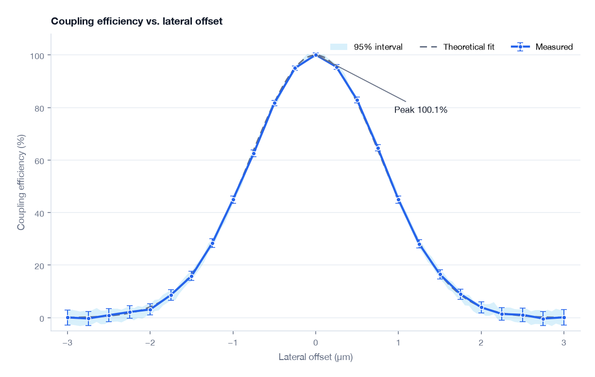
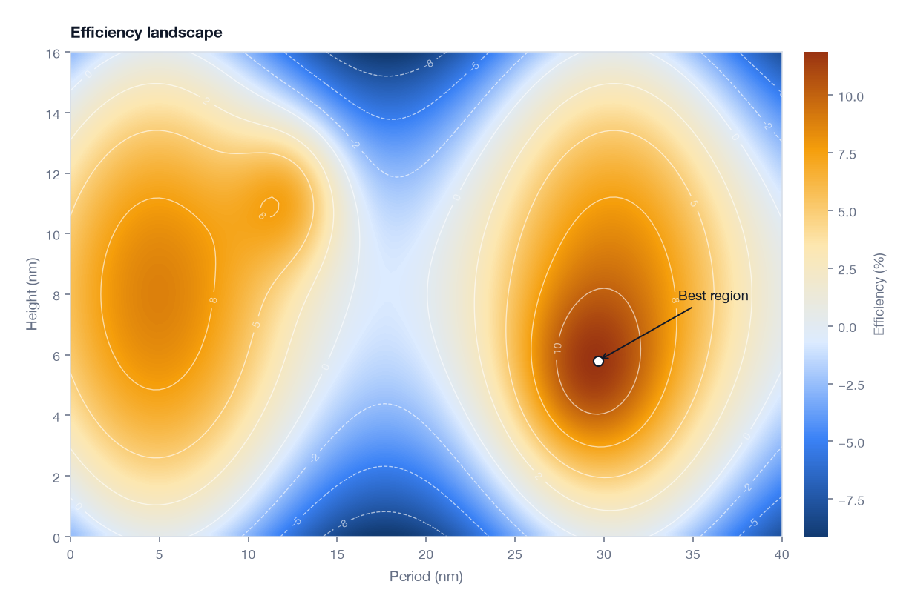
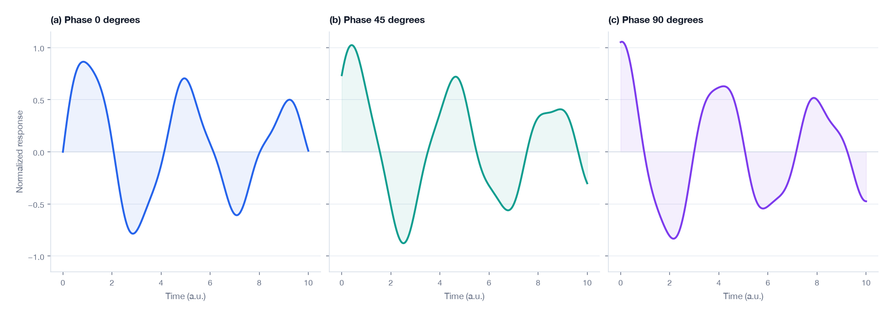
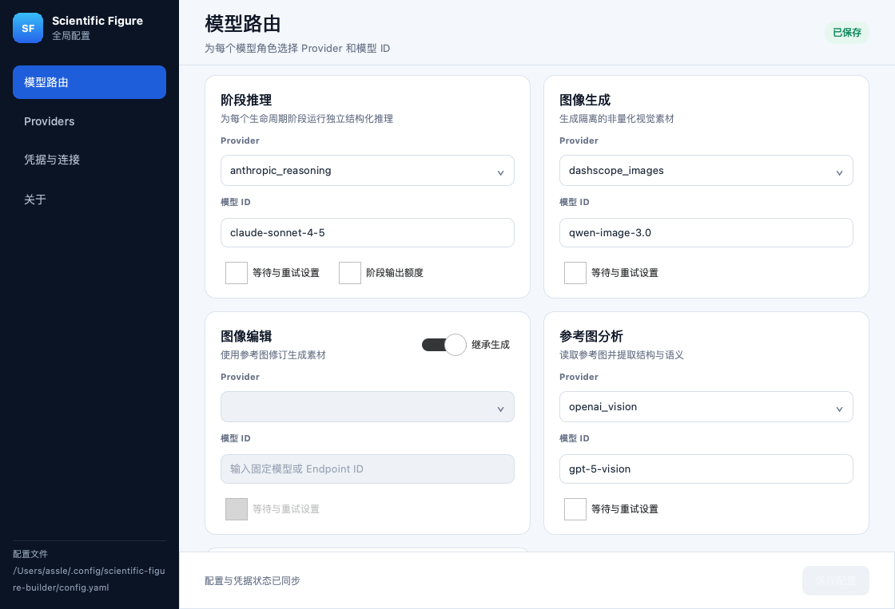
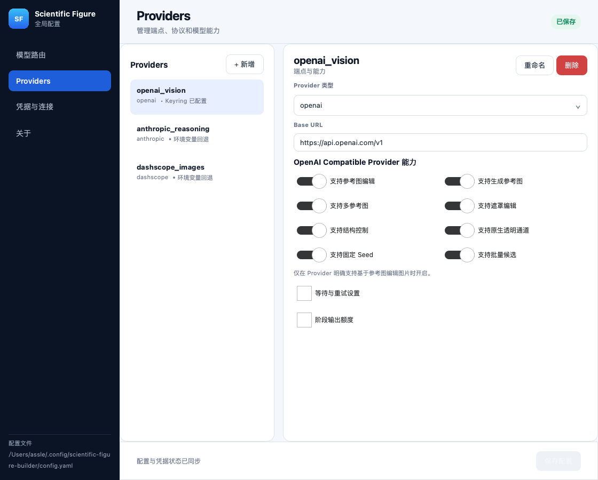
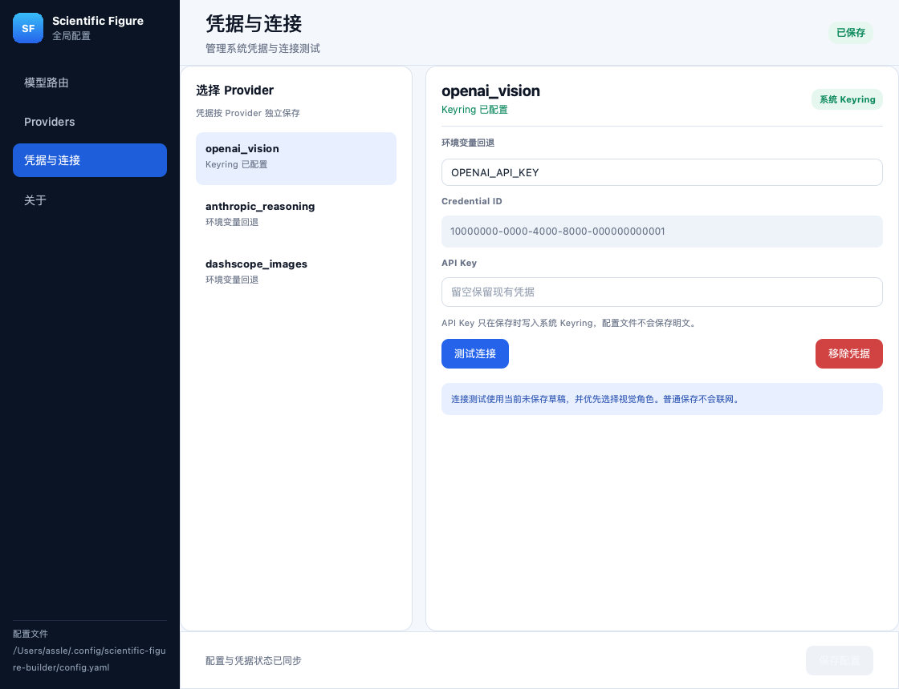

<p align="center">
  
</p>

<p align="center">
  <a href="./README.md">English</a> &nbsp;|&nbsp; <a href="./README.zh-CN.md">简体中文</a>
</p>

<p align="center">
  
  
  
  
  
  <a href="./LICENSE"></a>
</p>

<p align="center">
  把澄清后的科研配图需求转化为可复现素材、组合图、验证证据和出版级输出。
</p>

<p align="center">
  
</p>

## 产品与交付形态

Scientific Figure Builder 是完整的开源产品，不等同于其中任一组件。它由工作流
Skill、本地生命周期 MCP 服务、确定性核心运行时、CLI 和原生配置应用共同组成。

当前 `0.3.0` 开发版本提供 **原生 Codex 插件**、独立 OpenCode Agent 集成和带版本的
核心运行时。原生插件负责 Codex 中 Workflow Skill 与 MCP 声明的发现、启停、升级和
移除；独立核心运行时让确定性执行与可选配置应用不进入宿主插件缓存。

| 组件 | 职责 |
|---|---|
| 工作流 Skill | 告诉 Calling Agent 何时以及如何执行工作流 |
| 生命周期 MCP 服务 | 只公开 `initialize_figure_project` 与 `advance_figure_workflow` |
| 核心运行时 | 在本地拥有生命周期状态、执行、绘图、组装、验证和导出 |
| 配置应用 | 管理 Provider、Model route 和系统凭据 |
| Agent 集成 | 让 Codex 或 OpenCode 发现 Skill 与 MCP 服务 |

## 架构与生命周期

产品只有一条公开生命周期路径，也只有一个 Phase transition 权威：

```text
Calling Agent
  → 生命周期 MCP 服务（2 个公开工具）
    → Orchestrator（唯一生命周期权威）
      ├─ Phase worker → 受 Schema 约束的 Phase artifact
      ├─ Figure Planning Module
      │  └─ Figure Graph → Solved layout → SVG 蓝图
      │     → Generation Conditions + 结构问题
      ├─ Run Store + Run Invalidator → 原子持久化与精确复用
      └─ Figure Execution Module
         ├─ Python 数据图与 SVG/文字
         ├─ Provider 路由的隔离 raster 素材
         └─ 确定性连接线/分组 → 组装
            → 分层验证 → 局部修复 → 导出
```

MCP 服务是轻量 stdio Adapter，不会把绘图、Provider、验证或导出 helper 作为隐藏产品
工具发布。`advance_figure_workflow` 会校验输入/输出 Schema，构造一次 Runtime Context，
再由 Orchestrator 推进到下一个用户决策点或完成状态。

| 深模块 | 拥有的知识与行为 |
|---|---|
| Orchestrator | Intake、Planning、Execution、Review and repair、Export、审批、重试、恢复和 Export gate |
| Figure Planning Module | 审批前的 Figure Graph、Solved layout、可编辑蓝图、结构问题、Style Bible 和 Generation Conditions |
| Figure Execution Module | 已批准的 Generation route、风格锚点条件、候选选择、确定性组装、验证输入和发布 |
| Run Store | Run 目录结构、原子 JSON commit、Schema 校验、统一 hash、Artifact reference 和安全加载 |
| Run Invalidator | Figure brief/plan 变化、Repair、Assembly 变化与仅重新导出时的精确下游失效 |
| Provider Configuration | Provider type、旧协议迁移、类型字段、Model role catalog、继承和 Route compatibility |
| Runtime Context Factory | Effective configuration、凭据、transport、Provider client、预算、cache、Run state 和 Phase worker |

Run 复用依据内容而非“文件存在”。Schema 无效、hash 不匹配或被外部替换的产物不会复用。
仅布局变化的计划修订会保留有效的付费 raster；Python/SVG Repair 只重绘其源码派生输出；
图像编辑会保留无关的确定性素材和付费素材。

## 能得到什么

| | 能力 | 结果 |
|---|---|---|
| 📊 | 确定性数据图 | 从 CSV 生成折线、散点、柱状、热图、误差棒和多面板图 |
| 🧠 | 结构优先机制图 | 可寻址节点、命名端口、有类型有向边、分组、约束和可编辑 SVG 蓝图 |
| 🎨 | Provider-neutral AI 素材 | 带来源记录和自动去背景的隔离非量化视觉素材 |
| 🧩 | 精确组装与修复 | 资产级布局、端口绑定连接线、精确矢量标签/公式、遮罩编辑和回滚 |
| ✅ | 分层验证 | 最终图结构恢复、源文本/OCR/公式精确检查、几何、Publication profile 和多模态复核 |
| 📦 | 出版导出 | PNG、SVG、PDF，以及可选的 PowerPoint 友好 SVG/PPTX |

<p align="center">
  <table>
    <tr>
      <td align="center"><br><sub>可复现折线图</sub></td>
      <td align="center"><br><sub>确定性数据映射热图</sub></td>
      <td align="center"><br><sub>多面板组合</sub></td>
    </tr>
  </table>
</p>

## 可视化模型路由

原生 Qt Quick 应用用于管理全局 Model role、Provider 和系统凭据。打开或保存
配置不会启动浏览器、本地 Web 服务，也不会自动访问 Provider。

<p align="center">
  
</p>

<table>
  <tr>
    <td width="50%"></td>
    <td width="50%"></td>
  </tr>
  <tr>
    <td align="center"><sub>端点、协议与模型能力</sub></td>
    <td align="center"><sub>Keyring 凭据与主动连接测试</sub></td>
  </tr>
</table>

- **Providers**：负责端点增删改、接口方言和可选能力；当前支持 OpenAI Compatible、
  Anthropic Compatible，以及仅用于图像生成/编辑的 DashScope Native。
- **Provider capabilities**：显式声明参考图、多参考图、遮罩编辑、结构控制、
  原生透明、Seed 和批量候选；不支持的控制会明确失败，不会被静默忽略。
- **凭据与连接**：把 API Key 保存到操作系统 Keyring；只有用户点击时才测试当前未保存草稿。
- **模型路由**：把可选 `phase_reasoning`、`vision_analyze`、`image_generate`、
  可选 `image_edit` 和 `vision_validate` 绑定到 Provider 与固定模型 ID。
- **结构化输出扩容**：OpenAI Compatible 结构化响应从较小额度开始；只有 Provider
  明确返回 `incomplete/max_output_tokens` 时才翻倍重试，每次重试都计入角色调用预算
  和 Run State 审计，预算耗尽立即停止。
- 没有 Provider 时，路由选择器会禁用并直接引导到新增流程。

## 快速开始

### 1. 安装核心运行时与 Codex 插件

```bash
git clone https://github.com/assle/scientific-figure.git
cd scientific-figure
./install.sh --codex --with-gui
codex plugin marketplace add .
codex plugin add scientific-figure-builder@scientific-figure
```

核心命令只安装确定性引擎、生命周期 MCP 服务、CLI 和可选配置应用，不修改 Codex
配置；repo marketplace 随后让 Codex 原生安装并管理插件。无桌面环境可省略
`--with-gui`。OpenCode 用户使用独立入口 `./install.sh --opencode`。

### 2. 配置 Provider

```bash
scientific-figure gui
```

如果最初只安装了核心运行时，可随时补装或升级配置应用，不需要重新注册 Agent 集成：

```bash
scientific-figure install-gui
```

未安装组件时请求 `gui` 只会返回这条准确的修复命令，不会输出 Python traceback。
核心 MCP、绘图、验证和导出不会导入 Qt，因此在无桌面环境中仍然可用。

先创建 Provider，再分配 Model role。API Key 不会进入 YAML：全局配置只保存稳定
的 `credential_id`；服务器、CI 和无桌面环境仍可使用 `key_env` 环境变量。

### 3. 让 Agent 开始工作

```text
使用 scientific-figure-builder，根据 data.csv 创建发表级多面板科研图。
导出 PNG、SVG 和 PDF，并让 SVG 适合在 PowerPoint 中继续编辑。
```

生命周期 Orchestrator 会先把导出目标、图宽、语言、风格和可选 Publication profile
记录到 Figure brief。Planning 随后在任何付费工作前派生 Figure Graph、Solved layout、
可编辑 SVG 蓝图、结构问题和 Generation Conditions。Calling Agent 根据 Orchestrator
返回的下一动作继续，不再手动串联底层工具。每次响应都包含当前 Lifecycle phase、
状态、下一动作和规范化 Artifact reference。

## 核心规则

```text
精确数据、坐标轴、公式、文字和几何结构  →  Python / SVG
科学节点、阶段、端口和有向流向          →  Figure Graph + SVG
隔离的非量化视觉素材                    →  配置的图像 Provider
最终组合与导出                          →  本地确定性流水线
```

AI 图像模型不会绘制数据图或最终复合图。确定性检查保持权威；视觉模型可以补充
语义说明，但不能把几何检查的失败改成通过。

## 机制图工作流

```text
科学意图
  → Figure Graph（节点、端口、有类型边、分组、约束）
  → Solved layout + 可编辑 SVG 蓝图
  → Provider-neutral Generation Conditions
  → 隔离 raster 素材 + 确定性文字/连接线
  → 最终图结构/OCR/出版规范验证
  → 布局、连接线、矢量或遮罩 raster patch，并支持回滚
```

显式提供资产 bbox 时，坐标相对于所属 panel；仅修改布局会复用已经付费生成的 raster。
相关资产按 Style group 使用经过审批的风格锚点。参考图会标记为 content、style、
structure、parent 或 mask，并在上传前重新校验 hash。`nature_research` Publication
profile 提供 Nature 尺寸、字体、可编辑矢量和配色可访问性检查，`general` 仍是默认值。

## 最小 Provider 配置

GUI 会替你写入这些元数据；配置中刻意不包含 API Key：

```yaml
providers:
  vision_provider:
    type: openai
    base_url: https://api.example.com/v1
    key_env: VISION_API_KEY
  image_provider:
    type: dashscope
    base_url: https://dashscope.aliyuncs.com/compatible-mode/v1
    key_env: DASHSCOPE_API_KEY
    supports_image_edit: true
    supports_reference_image: true
    supports_multi_reference: true
    supports_mask_edit: false
    supports_structure_control: false
    supports_native_alpha: false
    supports_seed: true
    supports_candidate_batch: false

models:
  vision_analyze:  {provider: vision_provider, model: vision-model}
  image_generate:  {provider: image_provider,  model: image-model}
  vision_validate: {provider: vision_provider, model: vision-model}
```

省略 `image_edit` 即表示继承 `image_generate`。Keyring 凭据优先于环境变量回退。
只声明 Provider 实际支持的 capability；它们是兼容性契约，不是提示信息。
DashScope Native 会把上述 `compatible-mode/v1` 地址规范化为同地域的 `/api/v1`
原生根地址，并通过同步 multimodal-generation 接口立即下载结果图。它不能用于
`phase_reasoning`、`vision_analyze` 或 `vision_validate`。

## 导出目标

| 目标 | 适用场景 | SVG 文字 |
|---|---|---|
| `general` | 投稿、浏览器和通用矢量工具 | 转换为兼容性更好的路径 |
| `ppt` | PowerPoint 编辑和取消组合 | 保留为可编辑文字 |

## 安装选项

```bash
./install.sh                       # 默认：只安装核心运行时与 CLI
./install.sh --codex              # 显式安装原生 Codex 插件前置运行时
./install.sh --opencode           # 只安装核心与 OpenCode 集成
./install.sh --all                # 显式安装旧双宿主集成
./install.sh --opencode --project /path/to/project
./install.sh --verify             # 只验证核心并报告 GUI 状态
./install.sh --verify --opencode  # 验证核心与 OpenCode 集成
./install.sh --verify --with-gui  # 要求核心与 GUI 都已安装
```

迁移期保留兼容别名：`--runtime-only` 等价于默认 Core 目标，`--opencode-only` 等价于
`--opencode`，`--codex-only` 只安装 deprecated 的手工 Codex Skill/config 集成。正式
Codex 路径是 `--codex` 后通过 marketplace 安装原生插件。

OpenCode 配置更新理解 JSONC。安装、升级和定向卸载只编辑
`mcp.scientific-figure`（缺少时才创建 `mcp`/`$schema` 父节点），无关字段顺序、缩进、
行/块/行尾注释和尾随逗号均保持原文。无效 JSONC 会在任何安装事务开始前失败。

### 文件系统布局

代码、私有虚拟环境和依赖使用带版本的应用载荷前缀，不再放入 `XDG_DATA_HOME`：

| 类别 | Unix 默认位置 | Windows 默认位置 |
|---|---|---|
| 全局核心运行时 | `~/.local/lib/scientific-figure-builder/global/runtimes/<version>` | `%LOCALAPPDATA%\Programs\ScientificFigureBuilder\global\runtimes\<version>` |
| 项目核心运行时 | `~/.local/lib/scientific-figure-builder/projects/<project-id>/runtimes/<version>` | `%LOCALAPPDATA%\Programs\ScientificFigureBuilder\projects\<project-id>\runtimes\<version>` |
| 全局配置 | `$XDG_CONFIG_HOME/scientific-figure-builder/config.yaml` | `%APPDATA%\scientific-figure-builder\config.yaml` |
| 应用状态根目录 | `$XDG_STATE_HOME/scientific-figure-builder` | `%LOCALAPPDATA%\State\scientific-figure-builder` |
| 应用缓存根目录 | `$XDG_CACHE_HOME/scientific-figure-builder` | `%LOCALAPPDATA%\Cache\scientific-figure-builder` |
| 启动器 | `~/.local/bin/scientific-figure` | `%LOCALAPPDATA%\Programs\ScientificFigureBuilder\bin\scientific-figure.cmd` |

安装器接受绝对 XDG 覆盖；`SCIENTIFIC_FIGURE_INSTALL_HOME` 可覆盖应用载荷前缀，
`SCIENTIFIC_FIGURE_BIN_DIR` 可覆盖启动器目录。项目路径只用于生成隔离运行时标识，
不会移动用户项目。

每个 Agent 集成都指向一个确切 Product version。升级会先建立并验证新运行时，再切换
活动运行时记录，因此失败升级不会破坏旧版本。检测到旧
`$XDG_DATA_HOME/scientific-figure-builder` 运行时时，成功的全局安装会记录迁移来源并
保留旧目录用于回滚。完整全局卸载会同时删除版本化运行时 scope 和旧运行时；项目卸载
只删除自己的隔离 scope。

### 事务与保留策略

安装和升级在每个 Runtime scope 内作为一个文件系统事务执行。安装器先完成来源、配置、
启动器、权限和磁盘空间预检，再在同一文件系统的 staging 中用 non-editable 包构建核心
运行时并验证 CLI/MCP，最后原子提交 runtime、Skill、launcher、command、宿主配置和
活动运行时记录。任一步失败或进程中断都会按相反顺序恢复已替换路径。同一 scope 的锁
拒绝并发安装；后续安全运行会清理死亡安装器留下的孤儿 staging。

Delivery Interface 是 `InstallRequest → InstallResult`。Request 携带目标、Runtime scope、
Product version 和 GUI 选择；Result 报告 committed、retained、pruned 与日志路径。CLI
只负责把参数翻译到这个 Interface。OpenCode 与 deprecated 手工 Codex 交付由同一事务
中的独立 Host delivery Adapter 处理；原生 Codex 插件仍由宿主管理。

保留策略只留下活动 Product version 和至多一个已验证旧运行时。临时事务备份在提交或
回滚后删除。脱敏事务日志位于对应 XDG state 目录并最多保留 20 条，只记录路径和结果，
不记录配置正文或凭据。卸载器能够识别活动锁，不会删除正在安装的 runtime。

<details>
<summary><strong>安全卸载</strong></summary>

```bash
codex plugin remove scientific-figure-builder@scientific-figure
./uninstall.sh                    # 默认：只删除核心运行时与 CLI
./uninstall.sh --opencode         # 只删除 OpenCode 集成
./uninstall.sh --codex-legacy     # 只删除 deprecated 手工 Codex 集成
./uninstall.sh --integrations     # 删除两个旧集成，保留核心
./uninstall.sh --all              # 删除核心、旧集成、配置和引用凭据
./uninstall.sh --runtime-only --project DIR
./uninstall.sh --dry-run
codex plugin marketplace remove scientific-figure # 可选：不再列出这个 repo
```

原生插件移除会删除其缓存 Skill 和 MCP 声明，不创建或遗留顶层 Codex MCP 条目，并
保留独立核心运行时、Global configuration 和 Keyring 凭据。源码卸载器删除所选运行时
scope 的全部版本及可选 GUI，同时只清理旧安装器拥有的启动器和 MCP 条目。全局卸载
还会删除保留的旧运行时；Keyring 清理失败时会保留用户配置。
</details>

## 版本管理

Scientific Figure Builder 遵循[语义化版本](https://semver.org/lang/zh-CN/)。
`scientific-figure-builder/pyproject.toml` 是 Product version 的唯一权威来源；CLI
和生命周期 MCP 服务读取已安装 Python 包的版本。可通过下面的命令检查：

```bash
scientific-figure --version
```

项目当前处于 1.0 之前，`0.y.z` 版本仍可能调整公开接口。`0.3.0` 是当前开发版本，
`v0.1.0` 仍是最新固定发布。只有仓库同时存在不可变的 `vX.Y.Z` Git tag 和对应
GitHub Release 时，才构成一次正式发布。Schema、Phase prompt 和绘图 recipe 各自
拥有独立兼容性版本，不随 Product version 自动变化。

## 开发

### 仓库布局

这是一个 single-context 仓库：产品统一术语位于 `CONTEXT.md`，仓库级架构决策位于
`docs/adr/`。

```text
.
├── CONTEXT.md                         # 产品术语的唯一权威来源
├── docs/
│   ├── agents/                        # 工程 Skill 配置
│   ├── adr/                           # 仓库级架构决策
│   └── verification/                  # 当前平台验证证据
├── scientific-figure-builder/         # 核心、Skill 资源与测试的权威来源
├── plugins/scientific-figure-builder/ # 自动生成的原生插件快照
├── scripts/                            # 仓库维护脚本
├── assets/                             # README 图片
├── install.sh                           # 源码安装的公开入口
└── uninstall.sh                         # 源码卸载的公开入口
```

修改 `scientific-figure-builder/` 下的权威 Skill 资源后，在仓库根目录运行
`python3 scripts/sync_plugin_bundle.py`。不要直接编辑 `plugins/` 下生成的 Skill 副本；
测试会校验插件快照与权威来源完全一致。

### 本地开发

```bash
cd scientific-figure-builder
uv sync --extra gui
uv run --extra gui pytest -q
uv run --extra gui python -m figure_tools gui
uvx pyright --pythonpath .venv/bin/python figure_tools install
```

延伸阅读：

- [领域术语](./CONTEXT.md)
- [安全策略](./SECURITY.md)
- [GUI 跨平台验证](./docs/verification/gui-platforms.md)
- [真实 Provider 回归验证](./docs/verification/provider-regression.md)
- [OpenAI 插件架构](https://developers.openai.com/plugins/concepts/plugins)
- [OpenAI 插件打包](https://developers.openai.com/plugins/build/plugins)

## 开源许可

[MIT](./LICENSE)
