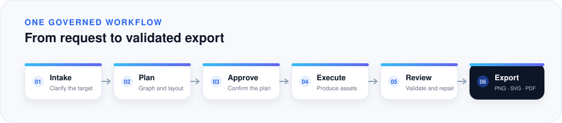

<p align="center">
  
</p>

<p align="center">
  <a href="./README.md">English</a> &nbsp;|&nbsp; <a href="./README.zh-CN.md">简体中文</a>
</p>

<p align="center">
  
  
  <a href="https://github.com/assle/scientific-figure/releases/latest"></a>
  <a href="./LICENSE"></a>
</p>

<p align="center">
  <strong>从澄清后的科研需求，到经过验证、可直接投稿的导出文件。</strong>
</p>

<p align="center">
  <br>
  <sub>使用合成演示数据生成的示意性复合输出。</sub>
</p>

Scientific Figure Builder 帮助 Agent 将澄清后的需求转化为有来源的图表和素材、
完成组装的科研图、验证证据及可交付文件。测量数据由确定性的 Python/SVG 路径处理；
配置好的模型 Provider 只负责适合的图像生成与视觉分析任务。

## 环境要求

- Python 3.11 或更高版本。
- [`uv`](https://docs.astral.sh/uv/)。
- 使用原生 Agent 工作流时需要 Codex；也可以只安装核心运行时。

## 主要能力

- 可复现的折线、散点、柱状、热图、误差棒和多面板数据图。
- 以科学结构为先的机制图，支持可寻址节点和连接关系。
- 付费生图前先展示计划并取得确认。
- 确定性组装、分层验证、局部修复和中断恢复。
- 导出 PNG、SVG、PDF，以及可选的 PowerPoint 友好 SVG/PPTX。
- 原生 Codex 插件、本地运行时、CLI 和可选配置应用。

<p align="center">
  <table>
    <tr>
      <td align="center"><br><sub>带误差范围的折线图</sub></td>
      <td align="center"><br><sub>效率参数空间</sub></td>
      <td align="center"><br><sub>多面板组合</sub></td>
    </tr>
  </table>
</p>

<p align="center">
  <sub>以上插图由合成演示数据生成，仅用于展示输出效果，不代表科研证据。</sub>
</p>

## 快速开始

下面每条命令都标明了应运行的位置。安装脚本和源码命令对当前目录有要求，安装后的
CLI 则可在任意目录运行。

### 1. 安装正式版本

克隆后，在仓库根目录运行：

```bash
git clone https://github.com/assle/scientific-figure.git
cd scientific-figure          # 仓库根目录，包含 ./install.sh
./install.sh --codex --release latest --with-gui
```

`./install.sh` 是仓库内脚本，必须在包含它的目录运行。无桌面环境时省略
`--with-gui`。如果只需要核心运行时和 CLI：

```bash
./install.sh --runtime-only --release latest
```

### 2. 在任意目录使用已安装的 CLI

安装完成后，`scientific-figure` 启动器不依赖仓库位置，以下命令可在任意项目目录运行：

```bash
scientific-figure status
scientific-figure gui
scientific-figure update --latest
```

如果当前 Shell 找不到启动器，请使用 `~/.local/bin/scientific-figure`，或把
`~/.local/bin` 加入 `PATH`。运行这些已安装命令时不需要 `cd` 回仓库。

### 3. 从源码启动 GUI

开发时应进入 `scientific-figure-builder/`，即包含 `pyproject.toml` 的目录，再运行：

```bash
cd scientific-figure-builder
uv sync --extra gui
uv run --extra gui python -m figure_tools gui
```

源码目录不会自动安装 `scientific-figure` 启动器。要运行当前源码，请使用上面的命令；
要运行已安装版本，请先完成第 1 步，再在任意目录执行 `scientific-figure gui`。

## 配置应用

原生 Qt Quick 应用用于管理 Provider、模型路由和系统凭据。它不会打开浏览器、监听端口，
打开或保存配置时也不会访问 Provider。

<p align="center">
  
</p>

<table>
  <tr>
    <td width="50%"></td>
    <td width="50%"></td>
  </tr>
  <tr>
    <td align="center"><sub>端点、协议与显式声明的能力</sub></td>
    <td align="center"><sub>系统凭据与主动连接测试</sub></td>
  </tr>
</table>

- 先创建 Provider，再绑定需要的模型角色。
- 应用保存的 API Key 会进入操作系统凭据存储，不会写入 YAML。
- 无桌面环境可通过 Provider 的 `key_env` 指定环境变量来提供凭据。
- 需要项目级覆盖时运行 `scientific-figure init /path/to/project`。

配置优先级为：内置默认值 → 全局配置 → 项目配置 → 单次运行覆盖。Provider 类型、模型
角色、文件位置和最小 YAML 示例见[用户指南](docs/user-guide.zh-CN.md)。

## 工作流

让 Codex 使用已安装的 Skill，并说明源数据、目标图形、语言、尺寸或期刊要求以及导出格式：

```text
使用 scientific-figure-builder，根据 data.csv 创建可投稿的多面板科研图。
导出 PNG、SVG 和 PDF，并让 SVG 适合在 PowerPoint 中继续编辑。
```

<p align="center">
  
</p>

测量数据和定量图表始终走确定性的 Python/SVG 路径；非定量的图形单元可以使用已配置的
Provider 路由。最终组装、验证、修复和导出在本地确定性完成。只有需要补充信息、确认计划、
选择修复或确认生成摘要时，工作流才会暂停。

## 更新、状态与卸载

安装后可在任意目录运行：

```bash
scientific-figure update --latest
scientific-figure status
```

更新会保留 Provider 配置、凭据引用、项目数据和运行产物。如果 `status` 返回
`restart_required`，请先保存当前工作，再完全退出并重新打开 Codex，让新的 MCP/GUI
进程加载已激活的运行时。只有需要主动查询 GitHub 最新版本时才使用
`scientific-figure status --remote`。

先回到仓库根目录预览卸载内容，再选择所需范围：

```bash
./uninstall.sh --dry-run
codex plugin remove scientific-figure-builder@scientific-figure
./uninstall.sh              # 删除核心运行时和 CLI，保留配置
./uninstall.sh --all        # 同时删除全局配置及其引用的凭据
```

原生插件和核心运行时拥有独立生命周期，完整卸载需要同时移除两者。除非明确使用 `--all`
或 `--config`，卸载器会保留全局配置和凭据。

## 文档

- [用户指南](docs/user-guide.zh-CN.md)：安装、配置、工作流、更新与卸载。
- [贡献指南](CONTRIBUTING.md)与[安全策略](SECURITY.md)。

## 开发

开发命令应在 `scientific-figure-builder/` 中运行：

```bash
cd scientific-figure-builder
uv sync --extra gui
uv run --extra gui pytest -q
uvx pyright --pythonpath .venv/bin/python figure_tools install
```

权威 Skill 位于 `scientific-figure-builder/SKILL.md`。修改后回到仓库根目录运行：

```bash
python3 scripts/sync_plugin_bundle.py
```

配置应用界面发生变化后，在仓库根目录重新生成 README 截图：

```bash
uv run --frozen --directory scientific-figure-builder --extra gui \
  python ../scripts/capture_readme_screenshots.py
```

示例配图使用同一套合成演示数据，可独立重新生成：

```bash
uv run --frozen --directory scientific-figure-builder \
  python ../scripts/generate_readme_examples.py
```

## 许可

[MIT](./LICENSE)
